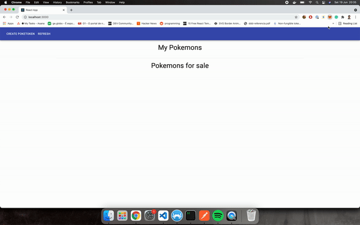
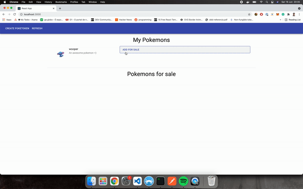
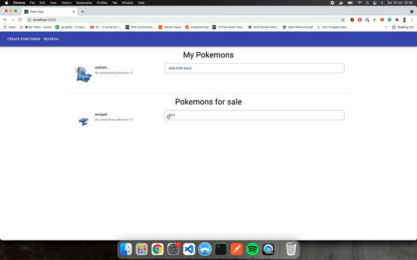

# NFT

## Project description

POC Project of a Pokemon marketplace using NFT.

With this project the client will be able to:

1. Create random pokemons
1. Setting prices for selling pokemons
1. Buying pokemons that are open for sale.

You can read more about it on this blogpost: [Creating a pokemon marketplace using NFT](https://cheesecakelabs.com/)

### Main Stack

1. Solitidy (Smart contracts)
1. Node.js (Backend)
1. React (Frontend)
1. OpenZeppelin (Solidity Reusable smart contracts)
1. Hardhat (Ethereum development environment)
1. Ethers (Ethereum blackchain interaction package)

This project also uses

1. [PokeAPI](https://pokeapi.co/api/v2/pokemon/) for generating random pokemons
1. [Pinata](https://pinata.cloud/) For IPFS management

## Running locally

To run the project locally you'll need to

1. Install the dependencies
1. Compile the smart contracts and copy the contract to the folder that is served by the backend
1. Start a network node and deploy the contract to it
1. Create a [Pinata](https://pinata.cloud/) account
1. Fill the environment variables and Start the project's backend and frontend

### Installing dependencies

1. Install [Node.js](nodejs.org)
1. Install Yarn by running `$ npm install -g yarn`
1. Install the rest of the dependencies by running `$ make install-dependencies` on the project root folder

### Compiling and serving the smart contract

You can compile the smart contract and copy it for the backend / frontend usage with a single command

```bash
$ make compile-and-copy
```

### Starting a node and deploying the contract

To start a network node you need to execute the command below on the terminal:

```bash
$ npx hardhat node
```

To deploy the smart contract to this node on another terminal window, execute:

```bash
$ npx hardhat run scripts/deploy.js --network localhost
```

### Creating a Pinata account and creating API keys

Creating a Pinata account is free and very intuitive, after doing that you'll need to create API keys in this [link](https://pinata.cloud/keys)

### Filling environment variables and starting the front and the back

Rename the files:
web/client/.env.example -> web/client/.env
web/.env.example -> web/.env

Fill the Pinata API Keys data on web/.env

On the web folder execute the command below to start a backend and a frontend instances on your local environment

```bash
$ yarn dev
```

## Deploying to another network

To deploy the contract to a live network you'll need:

1. An account with assets
2. An [Alchemy Key](alchemyapi.io/) (Optional)
3. Create a network on `hardhat.config.js` with the account's private key
4. Execute the deploy script pointing to the desired network e.g. `npx hardhat run scripts/deploy.js --network rinkeby`

The hardhat.config file has a Rinkeby Network and you can read more about setting networks on https://hardhat.org/hardhat-network/

## Testnet

This contract is currently deployed to the Rinkeby testnet.

- It can be checked on Etherscan
  https://rinkeby.etherscan.io/token/0xb7a6e62bb3b6752f4a3285fbf1a32f0394cf31ed?a=0x0bd8361d4bbd35842e6ead678cfadf59247c0188

- The tokens can be listed on Opensea
  https://testnets.opensea.io/collection/poketoken-v4

## Other scripts

- Testing `$ npx hardhat test`


### Demos

- Create random pokemons



- Setting prices for selling pokemons



- Buying pokemons that are open for sale.


